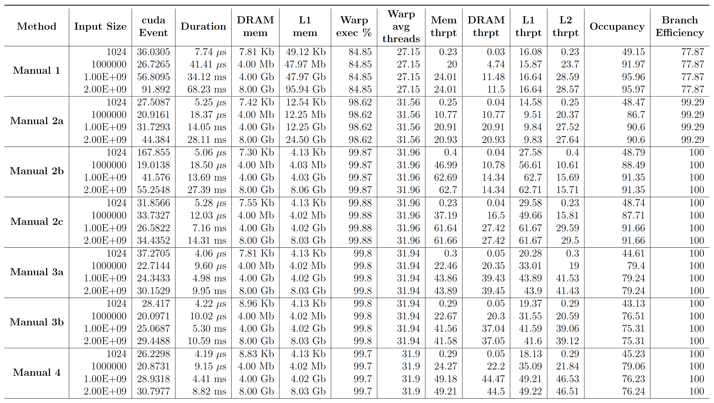

# CS5914-High-Performance-Code-Generation-Using-LLMs
Tensor Reduction in GPU (manual optimization)

By: Najibul Haque Sarker

# Reduction Strategies
### Manual 1: Naive Parallel Implementation
File: `parallel_reduction1.cu` <br> 
Logic: A straightforward tree-based reduction where each pair of elements is processed by one thread. This naive kernel loops over reduction steps, at each step having certain threads add a neighbor’s value to their own. For example, thread 0 adds thread 1’s element, thread 2 adds thread 3’s, and so on, halving the number of active threads each iteration. A barrier sync (__syncthreads()) is used between steps to ensure partial sums are visible to the next step. This is done until only one value is left, which will be the summation value.

### Manual 2a: Serial Addressing
File: `parallel_reduction2a.cu` <br> 
Logic: Alter the reduction loop to use serial addressing.  In serial addressing, threads with index below a certain threshold perform the addition with a partner thread above the threshold. This way, in each step, the lower half of threads in the block actively add the values of the upper half, eliminating warp-level divergence because all threads in a given warp either all pass the condition or all fail it as a group. The access pattern becomes more regular: thread 0 adds thread s, thread 1 adds thread s+1, etc., which are contiguous in memory. This ensures more active warps have all threads active simultaneously.

### Manual 2b: Serial Addressing + shared memory
File: `parallel_reduction2b.cu` <br> 
Logic: Doing read/write operation via global memory is costly. Instead transfer values to shared memory, which is local to threads of a block. Do the computation there, and write back the answer to global memory. Shared memory has substantially less overhead compared to global memory.

### Manual 2c: Serial Addressing + shared memory + coarse initial load
File: `parallel_reduction2c.cu` <br> 
Logic: During transfer to shared memory, add two elements from global memory and store result in shared memory. This decreases shared memory requirements from N to N/2.

### Manual 3a: Serial Addressing + shared memory + coarse initial load + Unrolling the Final Warp Loop
File: `parallel_reduction3a.cu` <br> 
Logic: Final stages of the reduction (when only a warp or less of threads remain) still rely on __syncthreads, which is a costly synchronization method. Once we get down to 32 or fewer elements, these threads reside within a single warp, which are by default synchronized. So __syncthreads isn't needed for this case, which increases performance.

### Manual 3b: Serial Addressing + shared memory + coarse initial load + Unrolling the Final Warp Loop + shuffle instructions
File: `parallel_reduction3b.cu` <br> 
Logic: Intra-warp communication can be done more efficiently using warp shuffle instructions rather than shared memory. So changed the last warp method to utilize shuffle instructions.

### Manual 4: Fully Unrolled Reduction Kernel 
File: `parallel_reduction4.cu` <br> 
Logic: Using C++ templates or launch-time constants to fully unroll the entire reduction for a given block size. The idea is to eliminate all loop overhead and make every memory access pattern a compile-time decision, which allows the compiler to optimize and schedule instructions most effectively.

# Run Code

Provided you have a file named `file.cu` with relevant cuda code, you can run the code and the appropriate profiling tools by providing the file name as command line argument to the bash file `run.sh`:
```
chmod +x run.sh
./run.sh file
```

Furthermore, the `extract_metrics` folder contains code to automatically take the above generated profiling data and output structured .csv files containing the necessary information.


# Manual Strategies Evaluation Benchmark



# References
- https://christianjmills.com/posts/cuda-mode-notes/lecture-009/
- David B. Kirk and Wen-mei W. Hwu. Programming Massively Parallel Processors: A Hands-on Approach. 2nd ed. San Francisco, CA, USA: Morgan Kaufmann Publishers Inc., 2012. isbn: 9780123914187.
- Mark Hassin. Optimizing Parallel Reduction in CUDA. CA, USA: NVIDIA, 2011.
- ncu commands: https://gist.github.com/getianao/1686c4d0dac02a0b91a2885e18d9c9a3 